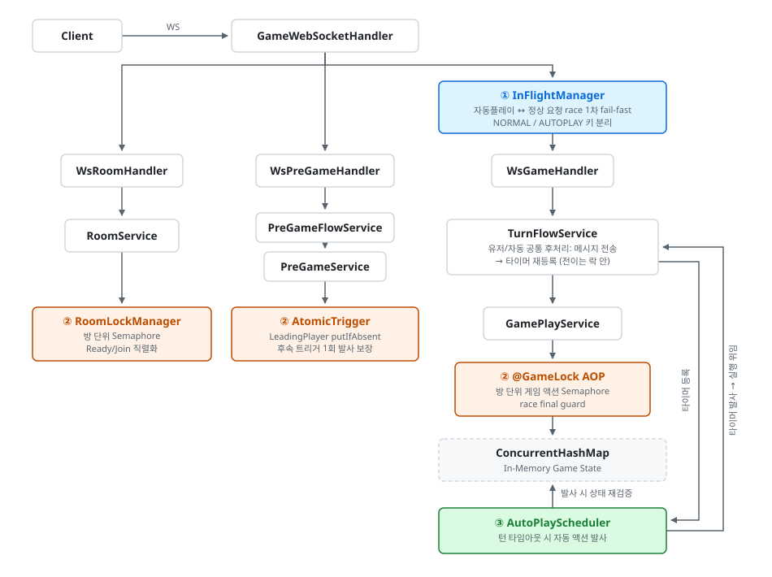

# 🎴 웹 고스톱 게임 (Web Go-Stop)

> **대규모 동시 접속 환경을 고려한 실시간 턴제 웹 고스톱 게임입니다.**
> 불필요한 네트워크/스레드 오버헤드를 줄여 **단일 서버에서 초당 평균 약 88,700건(1초 피크 95,310건)의 웹소켓 메시지를 안정적으로 처리**하도록 최적화했습니다.

**이 프로젝트에서 증명하려는 것 3가지:**

1. **WebFlux EventLoop를 멈추지 않는 락 설계** — 방 단위 `Semaphore` + `boundedElastic` 격리 + `Mono.usingWhen` 해제 보장
2. **자동플레이 ↔ 유저 요청 race의 layered defense** — In-Flight fail-fast → `@GameLock` 직렬화 → 락 내부 상태 재검증
3. **검증 가능한 성능 수치** — WS 동접 10,000에서 sustain 평균 88.7k / 1초 피크 95.3k msg/s (서버 실측). 계측 설계와 측정 한계까지 [방법론](#측정-방법론)으로 공개

**목차:** [기술 스택](#-기술-스택) · [아키텍처](#-아키텍처) · [Getting Started](#-getting-started) · [아키텍처 의사결정](#-기술-스택-선택-이유-및-아키텍처-의사결정) · [트러블슈팅](#-주요-트러블슈팅-및-성능-최적화) · [부하 테스트 결과](#-부하-테스트-결과)

<br/>

## 🛠 기술 스택

- Java 21, Spring WebFlux (Reactor), WebSocket
- 게임 상태 저장: `ConcurrentHashMap` In-Memory *(기본 프로파일)* / Redis + Redisson *(분산 프로파일)*
- 테스트: WebSocket 통합 테스트 (JUnit), k6 (부하·기능 테스트), InfluxDB + Grafana (시계열 모니터링)

<br/>

## 🏗 아키텍처

게임 도메인 특성상 **단일 서비스 (`game-service`)** 가 모든 게임 로직과 동시성 제어를 담당합니다. 이벤트는 카테고리별 핸들러로 분기되고, 각 단계에 맞는 동시성 레이어가 적용됩니다.

<picture>
  <source media="(prefers-color-scheme: dark)" srcset="docs/architecture-dark.svg">
  
</picture>

**동시성 3레이어 요약:**

- **① In-Flight 플래그** — **자동플레이(③)와 정상 요청 사이의 race 1차 fail-fast** 가 본 목적. 같은 플레이어 단위로 `NORMAL` / `AUTOPLAY` 키를 분리해, 자동플레이는 `isSet(NORMAL)`로 양보하고 정상 요청은 자동플레이 진행 중에도 In-Flight 단계에서 막히지 않음. TTL 만료 엔트리는 `ConcurrentHashMap.replace(k, old, new)` 기반 원자적 비교-교체 loop로 자동 갱신, 해제는 요청별 소유 토큰 검증 후 조건부 삭제. *(InFlight 통과 후의 race window는 `@GameLock`(②)의 직렬화 + 락 내부 재검증이 final guard, 두 플레이어 동시 액션은 `currentPlayer` 체크로 차단 — 책임 분리)*
- **② 직렬화 / atomic 제어 (역할 분리)** — **공유 객체 수정에는 락, 데이터가 player별로 분리된 곳에는 atomic 연산**으로 메커니즘 비용 최소화. 핸들러별로 본 목적이 다름:
  - **`RoomLockManager`** (방 단위 Semaphore): 단일 `GameState` 객체를 공유 수정하는 Ready/Join 작업과, 상대의 선택을 읽어 중복 월을 검증하는 선플레이어 카드 선택(read-검증-write)의 직렬화
  - **`@GameLock` AOP** (방 단위 게임 액션 Semaphore): InFlight를 통과한 자동플레이 ↔ 정상 요청 race의 final guard. 정확히는 2단 구조 — **락이 게임 액션을 직렬화하고, 락 획득 후 gameState를 fresh 재조회해 phase/currentPlayer를 재검증**해 이미 소비된 턴을 거름 (경쟁자마다 들고 온 상태 스냅샷이 다르므로 직렬화만으론 불충분). 이 재검증이 성립하도록 **턴 전환/고스톱 대기/종료 같은 상태 전이는 반드시 락 안에서 저장** — 락 해제 후로 미루면 그 사이 낡은 경쟁자가 재검증을 통과함
  - **`LeadingPlayer.tryClaimLeaderSelectionTrigger`** (`putIfAbsent` 기반 atomic): 월 값은 한 번 저장되면 불변이라 "둘 다 완료" 감지엔 락이 불필요 — 두 플레이어가 거의 동시에 선택을 마쳐도 후속 처리 트리거가 1회만 발생하도록 atomic으로 보장
- **③ AutoPlay 스케줄러** — 턴 타임아웃 시 자동으로 Game 액션 발사 (`NORMAL_SUBMIT` 카드 자동 제출 + `FLOOR_SELECT` 바닥 카드 자동 선택 + `GO_STOP_CHOICE` 자동 STOP). 타이머의 정체성을 **`TurnStep(round, turn, phase)`** 하나로 표현 — 등록 시점엔 TurnStep 순서 비교(같은 턴 안에서 제출 < 바닥 선택 < 고/스톱 선택) + `compute` 기반 atomic swap으로 낡은 등록이 유효한 타이머를 교체(파괴)하지 못하게 막고, 발사 시점엔 같은 TurnStep으로 게임 상태를 재검증해 낡은 타이머가 스스로 물러나게 함. 실행 자체는 사용자 요청과 동일한 **`TurnFlowService`** 흐름(상태 전이는 락 안에서 저장, 후처리는 메시지 전송 → 타이머 재등록)을 타므로 두 경로의 동작이 갈라질 수 없음

> **MSA → 단일 서비스 통합:** 초기에는 `api-gateway` / `user-service` / `auth-service` / `game-service` 의 MSA로 기획했으나, **`game-service`의 동시성/성능 최적화에 집중**하기 위해 나머지 서비스는 폐기하고 단일 서비스로 통합했습니다.

<br/>

## 🚀 Getting Started

### Prerequisites

- Java 21 (Gradle toolchain이 자동 설치)
- (선택) Redis 7.x — 분산 프로파일 사용 시

### 실행

```bash
# 기본 (in-memory)
./gradlew :game-service:bootRun

# Redis 분산 프로파일
./gradlew :game-service:bootRun --args='--spring.profiles.active=redis'
```

### 부하 테스트

```bash
# k6 설치 후
k6 run gostop-test.js
```

### 기능 테스트 — AFK 자동플레이 완주 (선택)

```bash
# 두 플레이어가 완전 방치(AFK)해도 서버 자동플레이(카드 제출 + 바닥 카드 선택 + 고/스톱 자동 STOP)만으로
# 게임이 정지 없이 완주되는지 검증 (1방 2인, 약 4~8분 소요)
k6 run gostop-afk-test.js
```

### 부하 테스트 시계열 모니터링 (선택)

InfluxDB + Grafana 스택을 Docker로 띄워 throughput 추이를 시계열로 관찰할 수 있습니다. 단, 5,000 VU 대규모 부하에서는 k6 → InfluxDB write backpressure로 샘플이 일부만 적재되므로(자세한 내용은 아래 [측정 방법론](#측정-방법론) 참조), **정확한 throughput은 k6 콘솔 집계를 신뢰하고 이 스택은 sustain 안정성 패턴 검증 용도로만 활용**합니다.

```bash
# 1. 스택 기동 (Docker Desktop 필요)
cd loadtest
docker compose up -d

# 2. k6를 InfluxDB output과 함께 실행 (프로젝트 루트에서)
cd ..
k6 run --out influxdb=http://localhost:8086/k6 gostop-test.js

# 3. Grafana 접속 (대시보드 자동 provision)
# http://localhost:3000  →  "k6 Load Testing Results" 대시보드
```

<br/>

## 💡 기술 스택 선택 이유 및 아키텍처 의사결정

### 1. Spring WebFlux & WebSocket : 턴제 게임의 긴 Idle Time 극복

턴제 게임은 유저가 고민하는 동안 서버 리소스를 거의 쓰지 않는 대기 시간(Idle Time)이 깁니다. Spring MVC는 WebSocket 연결당 1개의 스레드를 점유하는 구조라 동시 접속자가 늘수록 스레드가 낭비됩니다.

이를 해결하기 위해 **I/O 이벤트가 발생할 때만 스레드가 관여하는 Event-Driven 방식의 WebFlux를 채택**하여, 적은 스레드로도 대규모 동시 접속을 효율적으로 처리하도록 구성했습니다.

### 2. In-Memory 전환 (Redis ➡️ ConcurrentHashMap) : 처리량 극대화

초기에는 게임 상태 관리를 위해 Redis를 도입했으나, **단일 방 안에서만 상태 공유가 필요한 게임 도메인 특성**상 분산 캐시의 오버헤드가 불필요하다고 판단했습니다.

`ConcurrentHashMap` 기반의 인메모리 구조로 전환하여 **TCP 통신 및 직렬화/역직렬화 비용을 완전히 제거**했습니다. *(Redis 프로파일은 그대로 유지해 분산 배포 시 전환 가능)*

 **결과:** I/O 병목을 해소하여 단일 서버에서 **초당 평균 약 88,700건(1초 피크 95,310건)** 의 웹소켓 메시지를 처리합니다([부하 테스트 결과](#-부하-테스트-결과) 참조). 전환 시점의 동일 부하 시나리오 비교 측정에서는 Redis 프로파일 대비 **약 6.6배** 의 처리량 향상을 확인했습니다.

<br/>

## 🚨 주요 트러블슈팅 및 성능 최적화

### 1. WebFlux 환경에서의 Non-blocking Lock 설계

- **문제:** 단일 방 테스트에서는 정상이었으나, 다수의 방을 동시 플레이하는 부하 테스트에서 동시성 이슈가 발생했습니다. MVC 방식대로 `synchronized` 락을 적용했으나 문제가 해결되지 않고 오히려 병목이 심화되었습니다.
- **원인:** WebFlux는 소수의 EventLoop 스레드가 다수 요청을 비동기 처리합니다. 스레드 기반 블로킹 락은 EventLoop 자체를 멈추게 만들어, **락 대기가 아닌 다른 요청까지 처리 못 하는 기아 상태**를 유발합니다.
- **해결:** `ConcurrentHashMap` + `Semaphore` 조합으로 방 단위 락을 구현하되, EventLoop와 격리되도록 설계했습니다.
  1. **방 단위 격리:** `computeIfAbsent`로 방마다 독립된 `Semaphore(1)`을 할당해 락 경합 범위 최소화
  2. **EventLoop 보호:** `tryAcquire`는 블로킹 호출이므로 `Schedulers.boundedElastic()`로 분리, EventLoop가 멈추지 않도록 격리
  3. **자원 해제 보장:** `Mono.usingWhen`으로 정상 종료/에러/구독 취소 모든 경로에서 `semaphore.release()`가 호출되도록 보장하여 락 누수 차단

### 2. 운영 시나리오 기반 동시성 정합성 강화

초기 설계 이후, 운영/장기 부하 시나리오를 점검하며 발견한 race condition들을 추가로 보완했습니다. 각 항목은 실제로 재현·검증한 결함입니다.

- **In-Flight 플래그의 만료 처리**
  - 문제: TTL이 지났지만 잔존하는 stale 엔트리가 새 요청을 영구 차단
  - 해결: `ConcurrentHashMap.replace(k, old, new)` 기반 **원자적 비교-교체 loop**로 만료 엔트리를 안전하게 갱신

- **In-Flight 해제의 소유 토큰 검증**
  - 문제: 처리가 TTL을 초과해 플래그가 만료·재획득된 경우, 뒤늦게 끝난 원 소유자의 정리가 **새 소유자의 플래그를 오삭제** — Redis 분산 락의 "DEL 전 토큰 비교"와 동일한 고전 결함
  - 해결: 요청별 고유 토큰 저장 + 조건부 삭제. in-memory는 `remove(key, value)`(값 동등성 기반 원자 연산), Redis는 Redisson `compareAndSet(token, null)`(Lua 기반 조건부 DEL). 인터페이스 시그니처(`deleteFlag(key, token)`)에 토큰을 강제해 두 프로파일이 같은 계약을 이행

- **상태 저장 ↔ 방 정리(cleanup) race — zombie entry**
  - 문제: disconnect cleanup과 진행 중 게임 액션의 `save`가 동시 실행되면 `containsKey → put` 사이 TOCTOU로 **삭제된 방 상태가 부활**해 메모리 누수
  - 해결: `computeIfPresent` 기반 조건부 저장으로 존재 확인과 갱신을 원자화. Redis 프로파일은 `setIfPresent`(SET XX)로 동일 계약 유지

- **자동플레이 스케줄링의 원자성 — 타이머 정체성 `TurnStep`**
  - 문제: sequence 비교 → cancel → put이 분리되어 있어 그 사이에 race 발생. 이후 바닥 카드 자동 선택 도입으로 같은 (round, turn) 안에 "제출 대기 / 선택 대기" 두 단계가 생기자, 정수 시퀀스만으로는 낡은 앞 단계 타이머 등록이 유효한 뒤 단계 타이머를 파괴할 수 있었음
  - 해결: `ConcurrentHashMap.compute` 기반 **single-record atomic swap** + 타이머 정체성을 **`TurnStep(round, turn, phase)` 순서 비교**(같은 턴 안에서 제출 < 바닥 선택 < 고/스톱 선택)로 확장. 등록 시점의 교체 판정과 발사 시점의 상태 재검증이 같은 TurnStep 값을 공유

- **자동플레이 커버리지 공백 (liveness)**
  - 문제: 선 결정 직후 첫 턴은 타이머 등록 자체가 없고, 바닥 카드 선택 대기는 기존 타이머를 cancel만 하고 재등록하지 않아 **무입력(AFK) 플레이어가 있으면 게임이 영구 정지**. 즉시 응답하는 k6 봇 부하 테스트로는 드러나지 않는 유형
  - 해결: 첫 턴 타이머 등록 + 선택 타임아웃 시 자동 선택 구현. 두 플레이어가 완전 방치해도 서버 자동플레이만으로 게임이 완주되는지 확인하는 **AFK 기능 테스트**([`gostop-afk-test.js`](gostop-afk-test.js))를 별도 작성해 검증

- **GO/STOP 선택 대기의 상태·타임아웃 공백**
  - 문제: 고/스톱 대기가 명시적 상태 없이 진행되어 ⓐ 진입 phase 검증이 불가능해 고/스톱 국면이 아닐 때 도착한 STOP이 게임을 조기 종료시킬 수 있었고 ⓑ 대기 구간에 타이머가 없어 해당 플레이어 AFK 시 게임 정지 (마지막 남은 liveness 공백)
  - 해결: 두 문제의 뿌리가 같아 **명시적 phase(`AWAITING_GO_STOP_CHOICE`) 도입** 하나로 해소. 진입 시 상태를 저장해 락 내부 재검증(phase + currentPlayer)과 TurnStep 타이머 체계에 편입하고, 타임아웃 시 자동 STOP(확정 승리를 가져가는 안전한 기본값)으로 게임 종료를 보장

- **락 해제 ~ 상태 전이 저장 사이의 중복 실행 창구**
  - 문제: 카드 제출(선택 미유발)과 STOP이 턴 전환/END 저장을 `@GameLock` 해제 후의 후처리(결과 브로드캐스트 뒤)로 미뤄, 그 창구에 도착한 낡은 경쟁자가 락 내부 fresh 재검증(phase/turn 아직 그대로)을 통과할 수 있었음. 자동플레이 발사 직후 유저 제출이 겹치면 **같은 턴에 카드 2장 제출** → 손패 desync → 후속 자동플레이 실패로 게임 정지(liveness 상실)까지 증폭 가능. 유저의 마감 직전 클릭과 타이머 발사가 같은 deadline에 정렬되어 경합이 정확히 이 창구에 몰리는 유형
  - 해결: 다음 상태(고스톱 대기/종료/다음 턴) **결정·저장을 락 안으로 이동**하고 후처리는 메시지/타이머만 담당하도록 분리. 락 키도 `round:turn`·액션 종류별 세분화에서 **방 단위 단일 키로 통합** — 턴제 도메인상 한 방의 게임 액션은 한 시점에 한 행위자뿐이라 세분화가 병렬성을 사지 못하고 액션 종류 간 빈틈만 만들었음(동시성 설계 과잉 제거). "락 구간만 직접 실행 후 낡은 요청 주입"으로 창구를 결정적으로 재현하는 회귀 테스트로 고정

- **타이머 취소가 실행 중 체인을 중단시키던 메시지 유실**
  - 문제: 타이머(delay)와 실행이 한 구독으로 묶여 있어, 자동플레이 실행이 게임 종료 cleanup / 고·스톱 분기에서 `cancelAutoPlay`(= 자기 자신)를 호출하면 실행 중인 리액티브 체인이 dispose되어 **미전송 `GAME_OVER` / `GO_STOP_CHOICE` 메시지가 조용히 유실**. 위 AFK 완주 테스트에서 게임이 종반에 정지하는 현상으로 발견
  - 해결: 취소(dispose) 대상을 "대기 중인 타이머"로 한정하고 발사 이후의 실행을 독립 구독으로 분리. 발사 이후의 경합은 TurnStep 재검증 + In-Flight + `@GameLock`이 이미 방어하므로, 실행 중단은 애초에 correctness 수단이 아니었음

- **락 cleanup의 안전성 — 방어 코드가 새 race를 만든 사례**
  - 문제: 락 보유 중인 방을 즉시 제거하면 후속 요청이 새 Semaphore를 만들어 동시 진입할 수 있어 `tryAcquire` 성공 시에만 제거하는 방어를 시도. 그러나 이 변형이 `withLock`의 `computeIfAbsent → tryAcquire` 2단계 사이에 끼어들어 **다른 요청의 permit을 가로채 영구 timeout을 유발하는 새로운 race를 만든다는 것을 확인**
  - 판단: gameOver → cleanup 흐름상 해당 시점엔 락 경합이 사실상 없다는 도메인 근거로 단순 remove로 회귀 (이론적 완전성보다 실제 실행 경로 기반 판단)

- **정상 요청 ↔ 자동플레이 우선순위 충돌 해소**
  - 문제: 두 경로가 동일한 In-Flight 키를 공유해, 자동플레이가 deadline 임박 시점에 먼저 잡으면 정상 요청이 `TOO_MANY_REQUESTS`로 거부됨
  - 해결: 키를 **`NORMAL` / `AUTOPLAY` prefix로 분리**해 정상 요청이 In-Flight 단계에서 차단되지 않도록 변경. 자동플레이는 진입 시점 + 게임 로직 직전 두 단계로 `isSet(NORMAL)` 체크하여 양보하고, 정상 요청은 `@GameLock` 획득 콜백에서 `cancelAutoPlay`를 호출해 진행 중인 자동플레이를 abort. InFlight 통과 후의 잔존 race window는 `@GameLock`의 직렬화 + 락 내부 fresh 재검증이 final guard로 받아 **layered defense 완성**

- **"이탈 = 게임 종료"에서 이탈/재접속 처리로 고도화**
  - 문제: 게임 중 disconnect 시 방을 즉시 정리해, 순간적인 연결 끊김에도 게임이 파괴됨
  - 해결: **자동플레이가 진행(liveness)을 보장하는 행동 대기 phase에 한해 방을 보존**해 재접속 허용. 이탈자의 턴은 이미 등록된 자동플레이 타이머가 그대로 대행하므로 이탈 처리에 새 스케줄링 경로가 없고, 이탈을 별도 공유 상태로 만들지 않아(세션 슬롯 null = 이탈) 새 동기화 지점도 생기지 않음. 재접속은 별도 이벤트 없이 기존 `CONNECT` 재사용(보존된 `GameState`에 userId가 남아 입장 검증 자연 통과) + fresh 조회한 상태 스냅샷(`RECONNECT_STATE`: 손패/바닥/획득/점수/선택지/남은시간)으로 동기화. 마지막 접속자까지 이탈하면 즉시 전체 teardown(버려진 방을 headless로 완주시키지 않음)
  - 세션 경합 3단 방어: ⓐ 같은 슬롯의 낡은 세션은 매핑 제거 후 close — **중복 접속·좀비 TCP 모두 새 세션이 승리** ⓑ disconnect 정리는 그 세션이 아직 슬롯을 점유 중일 때만 수행 (identity guard) ⓒ 슬롯이 재점유됐으면 보존/teardown 판정 전에 disconnect 처리 자체를 중단해 **stale disconnect가 재접속 직후의 방을 파괴하는 TOCTOU 차단**
  - 검증: mock 세션으로 실제 핸들러 흐름을 구동하는 통합 테스트([`DisconnectReconnectTest`](game-service/src/test/java/com/pomingmatgo/gameservice/websocket/DisconnectReconnectTest.java)) 7건

- **브로드캐스트 수신자 목록의 assembly 시점 eager 평가 — 접속 직후 첫 응답 유실 회귀**
  - 문제: `sendMessageToAllUser`가 수신자 목록(`getAllUser`)을 리액티브 체인 **조립(assembly) 시점에 즉시 평가**. `addPlayer(...).then(broadcast)` 체인에서 자바의 인자 선평가 규칙상 세션 등록(runnable은 구독 시점 실행) **전에** 수신자를 캡처해, 접속 직후 첫 브로드캐스트(CONNECT 응답)가 유실됨 — 클라이언트는 응답 대기 상태로 정지해 게임이 시작되지 않는 회귀. 재접속 기능 도입 시 `handleJoinRoom` 재구성으로 유입
  - 발견: 부하 테스트 재실행에서 throughput이 기대치의 1/400로 떨어진 것을 계기로, 서버 송신 시계열 → 2 VU 수신 메시지 전수 로깅("각 세션의 첫 수신 메시지만 유실" 패턴 식별) → 수신자 수 진단 로그(`recipients=0`)로 범위를 좁혀 특정. 단위 테스트는 전부 통과하는 유형이라 **E2E 부하 테스트가 유일한 검출 수단**이었음
  - 해결: `Flux.defer`로 수신자 조회를 **구독 시점으로 지연**. "cold publisher 조립 시점에 상태를 캡처하지 않는다"는 리액티브 원칙을 코드 주석으로 명문화

### 3. 네트워크 지연 및 OS 시간 역전을 고려한 타임아웃 정밀도 향상

- **문제:** 클라이언트-서버 간 네트워크 지연(Latency) 및 타이머 오차로 인해, 유저 입장에서는 턴 시간이 남았음에도 서버에서 타임아웃 처리되는 불일치가 발생했습니다.
- **해결 1 (네트워크 지연 보정):** 서버 측 타임아웃 계산 시 **유예 시간** 을 도입하여 RTT 차이를 극복
- **해결 2 (Monotonic Clock 도입):** NTP 동기화 등으로 인한 시스템 시간 역전에 대비하여, `System.currentTimeMillis()` 대신 **단조 증가 시계인 `System.nanoTime()`** 을 사용하여 타임아웃 계산의 신뢰성 확보

<br/>

## 📊 부하 테스트 결과

### 환경

- **하드웨어:** Intel i7-14700 (20 코어 / 28 스레드), RAM 32GB, Windows — **부하 도구(k6)와 서버가 동일 머신에서 실행** *(k6 자체의 CPU 사용이 포함된 단일 데스크톱 기준 처리량 상한 측정값으로, 프로덕션 서버 환경의 절대 수치가 아닌 최적화 효과 비교용 지표)*
- **JVM:** Java 21 (G1GC, default)
- **부하 도구:** [k6](https://k6.io/) v1.7.1 — 시나리오 코드: [`gostop-test.js`](gostop-test.js)
- **서버 측 계측:** 초당 송신 WS 메시지를 서버가 직접 측정 — [`ThroughputRecorder`](game-service/src/main/java/com/pomingmatgo/gameservice/global/metrics/ThroughputRecorder.java) (`GET /internal/metrics/throughput`)

### 시나리오

- 동시 게임 방 5,000개 × 2명 = **WebSocket 동접 10,000**
- stages: 2분 ramp up → 7분 sustain (5,000 VU) → 1분 ramp down
- 각 가상 유저는 방 생성 → 입장 → READY → 게임 진행(카드 제출/바닥 선택/GO·STOP) → 종료 후 재준비를 반복
- 스크립트에 **thresholds 내장** (에러 0건, 무응답 타임아웃 0건, 게임 액션 RTT P95 < 1s, checks > 99%) — 매 run이 자체 합격/불합격 판정

### 결과 (2026-07 재측정, 전 thresholds 통과)

| 지표 | 값 |
| :--- | :--- |
| 초당 WS 송신 메시지 — sustain 평균 (서버 실측) | **약 88,700 msg/s** (중앙값 91,196) |
| 초당 WS 송신 메시지 — 1초 피크 (서버 실측) | **95,310 msg/s** |
| 초당 WS 메시지 (k6 수신, 10.5분 전체 평균) | 약 76,500 msg/s |
| 총 송수신 메시지 | 약 48,210,000 |
| **게임 액션 RTT** avg / med / P95 / P99 / max | **11.7ms / 1ms / 67ms / 125ms / 305ms** |
| 완주된 게임 수 | 228,460 판 (약 363 games/s) |
| 서버 에러 / 무응답 타임아웃 | **0건 / 0건** (checks 100%) |
| WS Handshake P95 / P99 / max | 3.99ms / 8.6ms / 84.9ms |

> **게임 액션 RTT** = 카드 제출/바닥 선택/고·스톱 선택 전송 → 그 처리 결과를 서버가 처음 push할 때까지의 시간 (k6 custom `Trend`로 측정). 실시간 게임의 체감 품질을 대표하는 지표로, 부하 상태에서도 P99 125ms를 유지.

### 측정 방법론

- **서버 측 1초 단위 실측:** 초기엔 k6 콘솔 평균(ramp up/down이 희석한 값)에 구간 가중치를 두어 sustain 피크를 *추정*했으나, 추정치는 방어가 어렵다고 판단해 **서버가 송신 메시지를 직접 세도록 계측을 추가**(`LongAdder` 카운트 + 1초 샘플링, hot path 비용은 increment 1회). 표의 sustain 평균/피크는 램프업 완료 후 7분 구간의 실측 시계열 통계
- **클라이언트 측 RTT/에러 계측:** k6 custom `Trend`(액션 RTT) / `Counter`(서버 에러, 무응답 타임아웃, 완주 게임 수)를 스크립트에 내장. 에러율 없는 throughput 수치는 의미가 없으므로 결과표에 에러/타임아웃 건수를 함께 보고
- **InfluxDB 시계열 측정의 한계 (서버 측 계측 전환의 계기):** 1초 단위 max를 측정하려 InfluxDB + Grafana를 도입했으나, 5,000 VU 부하에서 k6 → InfluxDB write가 backpressure로 **sample의 약 1.5%만 적재**되어 실패. 클라이언트 측 export가 병목이면 측정 대상(서버)이 직접 세는 것이 정확하다는 결론으로 위 서버 측 계측을 도입 (셋업은 [`loadtest/`](loadtest/)에 보존, Grafana는 sustain 안정성 패턴 확인 용도)
- **Run-to-run 변동성:** 동일 환경 반복 측정 시 평균 throughput 약 ±5% 변동. 표의 값은 단일 대표 run의 실측값
