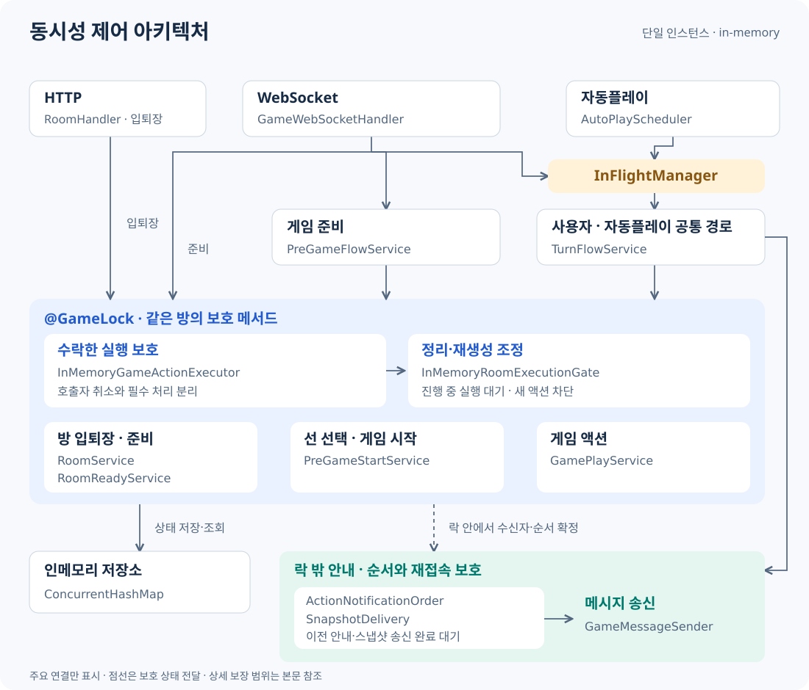

# 🎴 웹 고스톱 게임 (Web Go-Stop)

**Java 21 · Spring WebFlux · WebSocket 기반의 1:1 실시간 턴제 맞고 서버입니다.**

단일 서버의 동시성 제어와 처리량 개선에 집중한 프로젝트입니다. 기존 인메모리 부하 측정에서는 WebSocket 동접 10,000에서 초당 평균 약 89,500건의 서버 송신을 기록했습니다. 측정 환경과 한계는 [부하 테스트 결과](#-부하-테스트-결과)에 정리했습니다.

**주요 구현**

- **동시성 제어:** In-Flight 제어 → 방 단위 `@GameLock` → 락 내부 최신 상태 재검증
- **자동플레이:** 카드 제출·바닥 카드 선택·고/스톱 대기를 모두 타임아웃으로 처리
- **재접속:** 행동 대기 중 이탈한 사용자의 방 보존과 `RECONNECT_STATE` 상태 동기화
- **결정성 검증:** 고정 덱과 같은 명령 순서로 게임을 재실행해 최종 상태 비교
- **성능 계측:** 서버 송신량과 k6 액션 RTT·에러·타임아웃을 함께 측정

### 현재 지원 범위

- **실행 중인 서버 내 게임 진행과 재접속**을 지원합니다. 인메모리 상태는 프로세스 종료 시 소실되며, 영속 로그·스냅샷·프로세스 장애 복구는 구현되어 있지 않습니다.
- **단일 인스턴스 운영**을 전제로 합니다. Redis 프로파일에서도 WebSocket 세션과 자동플레이 타이머는 인스턴스 로컬 상태이므로, 다중 인스턴스 운영에는 방 단위 라우팅과 소유권·복구 설계가 필요합니다.
- **총통 감지는 구현되어 있지만 승부 처리는 미구현**입니다. 한쪽 또는 양쪽에 총통이 있어도 현재는 첫 턴으로 진행합니다.

**목차:** [기술 스택](#-기술-스택) · [아키텍처](#-아키텍처) · [실행 및 테스트](#-실행-및-테스트) · [설계와 트러블슈팅](#-설계와-트러블슈팅) · [부하 테스트 결과](#-부하-테스트-결과)


## 🛠 기술 스택

| 구분 | 구성 |
| --- | --- |
| 언어·빌드 | Java 21, Gradle |
| 서버 | Spring Boot 3.3.5, Spring WebFlux/Reactor, WebSocket |
| 기본 저장소·락 | `ConcurrentHashMap` 기반 In-Memory, 방 단위 `Semaphore` |
| 선택 저장소·락 | Redis, Redisson (`redis` 프로파일) |
| 테스트 | JUnit 5, reactor-test, WebSocket 통합 테스트 |
| 부하·계측 | k6, 서버 측 `ThroughputRecorder`, InfluxDB/Grafana 구성 파일 |

활성 모듈은 `game-service` 하나입니다. 초기 MSA 구성의 `config-server`, `api-gateway`, `user-service`, `auth-service`는 현재 빌드에 포함하지 않습니다.

## 🏗 아키텍처

`GameWebSocketHandler`가 이벤트를 방·게임 준비·게임 액션 핸들러로 분기합니다. 아래 그림은 인메모리 경로의 구성입니다.

<picture>
  <source media="(prefers-color-scheme: dark)" srcset="docs/architecture-dark.svg">
  
</picture>

### 게임 진행 경로

사용자 액션은 `GameWebSocketHandler → WsGameHandler → TurnFlowService → GamePlayService(@GameLock)` 순서로 실행됩니다. 자동플레이도 `TurnFlowService`를 사용합니다.

- **`GamePlayService`:** 락 획득 후 최신 phase와 currentPlayer를 재검증하고, 턴 정산과 다음 상태 저장을 락 안에서 완료합니다.
- **`TurnFlowService`:** 저장된 결과에 따라 메시지를 전송하고 다음 행동의 타이머를 등록합니다.
- **`CardMatchEngine` / 점수·정산 클래스:** 카드 매칭 규칙과 점수 계산을 담당합니다.
- **`PreGameFlowService`:** 선플레이어 결정 이후 카드 분배와 첫 턴 시작을 연결합니다.

### 동시성 제어의 역할

| 구성 요소 | 역할 |
| --- | --- |
| `InFlightManager` | 중복 요청과 자동플레이 경합의 1차 제어. `NORMAL` / `AUTOPLAY` 키 분리, TTL 기반 만료 처리, 소유 토큰 검증 후 해제 |
| `RoomLockManager` | Ready/Join 공유 상태 수정과 선플레이어 카드 선택의 read-검증-write 직렬화 |
| `tryClaimLeaderSelectionTrigger` | 두 플레이어 선택 완료 후 후속 처리를 한 번만 실행 |
| `@GameLock` | 카드 제출·바닥 선택·고/스톱을 같은 방 단위 락으로 직렬화하고 최신 상태 재검증 |
| `AutoPlayScheduler` | `TurnStep(round, turn, phase)` 순서에 따라 타이머 교체, 발사 시 상태 재검증 |

정상 요청은 자동플레이의 In-Flight 키 때문에 차단되지 않으며, 자동플레이는 정상 요청이 진행 중인지 확인해 양보합니다. 이미 실행에 들어간 두 경로의 경합은 게임 락과 상태 재검증으로 처리합니다.

인메모리 게임 락은 대기 없는 `tryAcquire()`를 사용하고, 획득에 실패하면 `TRY_AGAIN`을 반환합니다. 반면 방 락은 timeout을 둔 `tryAcquire(timeout, unit)`의 대기를 `boundedElastic`에 격리합니다. 락 해제는 `Mono.usingWhen`으로 정상·오류·취소 경로를 처리합니다.

고/스톱 처리에서는 최신 상태 검증부터 다음 턴 또는 종료 상태 저장까지 하나의 락 범위에서 끝냅니다. 아래는 [`GamePlayService.executeGoStop`](game-service/src/main/java/com/pomingmatgo/gameservice/domain/service/matgo/GamePlayService.java)의 발췌입니다. `markEnded`는 `END` 상태를 저장하므로, 락 해제 후 도착한 낡은 GO 요청은 phase 검증에서 거절됩니다.

```java
@GameLock
public Mono<GameState> executeGoStop(long roomId, Player player, boolean go, Runnable onActionSucceeded) {
    return validatedFreshState(roomId, GamePhase.AWAITING_GO_STOP_CHOICE, player)
            .flatMap(freshState -> go
                    ? gameService.applyGo(freshState, player).flatMap(this::proceedToNextTurn)
                    // STOP도 락 안에서 END를 저장 — 저장 없이 반환하면 락 해제~cleanup 사이 낡은 GO가 재검증을 통과한다
                    : markEnded(freshState))
            .doOnNext(result -> actionSucceeded(onActionSucceeded));
}
```

### 자동플레이·재접속

행동 제한은 10초이며 서버는 2초의 유예를 더해 자동플레이를 실행합니다. deadline과 경과 시간은 `System.nanoTime()`으로 계산합니다. 카드 제출뿐 아니라 바닥 선택은 0번 선택지, 고/스톱은 STOP으로 자동 처리합니다.

행동 대기 phase에서 상대가 접속 중이면 이탈자의 방을 보존하고 기존 타이머로 진행합니다. 재접속은 기존 `CONNECT`와 `RECONNECT_STATE`를 사용해 손패·바닥·획득 카드·점수·선택지·남은 시간을 동기화합니다. 세션 identity를 확인해 낡은 disconnect가 새 연결을 지우지 않도록 하고, 마지막 접속자 이탈 시에는 방 자원을 정리합니다.

## 🚀 실행 및 테스트

### 준비

- JDK 21을 설치하고 `JAVA_HOME`을 설정합니다. Gradle toolchain에 Java 21이 지정되어 있지만 자동 다운로드 설정은 없습니다.
- 로컬 Gradle wrapper는 8.5입니다. wrapper 파일은 Git 추적 대상이 아니므로 새 체크아웃에서는 Gradle 8.5를 준비한 뒤 `gradle wrapper --gradle-version 8.5`로 생성합니다.
- `redis` 프로파일을 사용할 때는 Redis 서버가 필요합니다.

아래 명령은 저장소 루트의 PowerShell 기준입니다. Linux/WSL에서는 `.\gradlew.bat`을 `./gradlew`로 바꿉니다.

### 서버 실행

```powershell
# Redis 없이 인메모리로 실행
.\gradlew.bat :game-service:bootRun --args='--spring.profiles.active=in-memory --spring.autoconfigure.exclude=org.redisson.spring.starter.RedissonAutoConfigurationV2,org.springframework.boot.autoconfigure.data.redis.RedisAutoConfiguration,org.springframework.boot.autoconfigure.data.redis.RedisReactiveAutoConfiguration'

# Redis 저장소와 분산 락 사용
.\gradlew.bat :game-service:bootRun --args='--spring.profiles.active=redis --spring.data.redis.host=localhost --spring.data.redis.port=6379'
```

기본 프로파일은 `in-memory`이지만 Redisson starter 자동 설정이 Redis 연결을 시도할 수 있어, Redis 없는 실행에는 위 제외 설정을 사용합니다. Redis 접속 정보는 명시적으로 전달합니다. `application-dev.properties`는 `redis` 프로파일만 활성화했을 때 자동으로 적용되지 않습니다.

| 항목 | 기본 주소 |
| --- | --- |
| HTTP | `http://localhost:8084` |
| WebSocket | `ws://localhost:8084/gostop` |
| 서버 송신량 | `GET http://localhost:8084/internal/metrics/throughput` |

송신 계측은 기본 활성화되어 있습니다. `--metrics.throughput.enabled=false`로 끄면 계측 빈과 엔드포인트가 비활성화됩니다.

### 게임 시작 흐름

1. HTTP `POST /room`으로 방을 생성하고, 두 사용자가 각각 `POST /room/join`으로 참가합니다.
2. 각 사용자가 `/gostop`에 WebSocket을 연결하고 `CONNECT` 요청으로 방과 사용자를 연결합니다.
3. 두 사용자가 `READY`를 보내면 선플레이어 선택이 시작됩니다. 각자 `LEADER_SELECTION`을 보내면 서버가 카드 분배와 첫 턴을 진행합니다.
4. 서버의 턴·선택 안내에 따라 `NORMAL_SUBMIT`, `FLOOR_SELECT`, `GO_STOP_CHOICE`를 보냅니다. 게임 종료 후 두 사용자가 다시 `READY`를 보내 다음 판을 시작할 수 있습니다.

요청 형식과 응답별 처리 예시는 [`gostop-test.js`](gostop-test.js)에 있습니다. 서버 실행 후 한 방의 진행을 확인하려면 아래의 AFK 테스트를 사용할 수 있습니다.

### 테스트 및 빌드

```powershell
# 모듈 전체 테스트
.\gradlew.bat :game-service:test

# 동시성·자동플레이·재접속
.\gradlew.bat :game-service:test --tests '*ConcurrentGameActionTest' --tests '*AutoPlay*Test' --tests '*DisconnectReconnectTest'

# 카드 순서·결정성
.\gradlew.bat :game-service:test --tests '*CanonicalCardOrderTest' --tests '*DeterminismReplayTest'

# 빌드
.\gradlew.bat :game-service:build
```

테스트 보고서는 `game-service/build/reports/tests/test/index.html`에 생성됩니다. 인메모리 통합 테스트의 통과가 Redis 동작까지 검증하는 것은 아닙니다.

### k6 테스트

서버를 먼저 실행하고 k6를 설치한 뒤 사용합니다. 두 스크립트는 기본적으로 `127.0.0.1:8084`에 접속합니다.

```powershell
# 5,000방 / WebSocket 10,000연결 부하 테스트
k6 run gostop-test.js

# 1방 2인이 입력하지 않아도 자동플레이로 완주하는지 확인 (약 4~8분)
k6 run gostop-afk-test.js
```

[`loadtest/docker-compose.yml`](loadtest/docker-compose.yml)은 선택적인 InfluxDB/Grafana 계측 환경입니다. 게임 서버나 Redis를 기동하는 구성은 아닙니다.

## 💡 설계와 트러블슈팅

### WebFlux와 인메모리 저장소

턴제 게임은 사용자 입력을 기다리는 시간이 깁니다. WebFlux의 비동기 I/O와 Reactor 조합으로 다수 연결의 이벤트를 처리하고, EventLoop에서 락 대기가 발생하지 않도록 설계했습니다.

기본 저장소는 Redis에서 `ConcurrentHashMap` 기반 인메모리로 전환해 상태 접근의 네트워크 왕복과 직렬화 비용을 줄였습니다. Redis 구현은 동일 저장소 계약의 선택 프로파일로 유지합니다.

### 주요 문제와 해결

| 문제 | 해결 |
| --- | --- |
| TTL이 만료된 In-Flight 엔트리가 새 요청을 차단하거나, 늦게 끝난 요청이 새 소유자의 플래그를 삭제 | 인메모리의 만료 엔트리를 원자적으로 교체하고, 해제 시 소유 토큰을 검증 |
| 방 정리와 저장의 경합으로 삭제된 GameState가 다시 생성 | GameState 갱신에 인메모리 `computeIfPresent`, Redis `setIfPresent`를 사용 |
| 타이머 취소가 실행 중 체인까지 끊어 종료 메시지 유실 | 취소 대상을 대기 중인 delay로 한정하고 발사 이후 실행 구독 분리 |
| 접속 직후 첫 브로드캐스트 유실 | `Flux.defer`로 수신자 조회를 세션 등록 이후의 구독 시점까지 지연 |

타이머는 늦게 등록됐다는 이유만으로 기존 타이머를 덮어쓰지 않습니다. [`AutoPlayScheduler.scheduleAutoPlay`](game-service/src/main/java/com/pomingmatgo/gameservice/scheduler/AutoPlayScheduler.java)는 `(round, turn, phase)` 순서를 비교해 유지할 타이머를 원자적으로 결정합니다. 아래는 등록·교체 부분의 발췌입니다.

```java
Disposable[] toDispose = new Disposable[1];
scheduled.compute(roomId, (k, prev) -> {
    if (prev != null && prev.step.compareTo(newStep) > 0) {
        toDispose[0] = newTask;
        return prev;
    }
    toDispose[0] = (prev != null) ? prev.task : null;
    return new Scheduled(newStep, deadlineNanos, newTask);
});

if (toDispose[0] != null && !toDispose[0].isDisposed()) {
    toDispose[0].dispose();
}
```

같은 단계의 연속 바닥 선택은 재등록이 필요하므로 비교는 `>= 0`이 아닌 `> 0`입니다. 교체에서 제외된 타이머의 대기 작업만 `compute` 밖에서 취소합니다.

### 카드 순서와 결정성

바닥·획득 카드는 저장소 조회 시 `Card` natural order로 정렬해 선택지 인덱스와 피 뺏기 결과가 Set 순회 순서에 좌우되지 않게 합니다. 손패와 덱은 순서 자체가 게임 의미를 가지므로 유지합니다.

[`DeterminismReplayTest`](game-service/src/test/java/com/pomingmatgo/gameservice/service/DeterminismReplayTest.java)는 고정 덱으로 실행한 게임의 명령을 다른 방에서 재실행하고 게임 상태·손패·획득 카드·바닥·잔여 덱을 비교합니다. 이 테스트는 게임 로직의 재현성을 확인하며, 영속 저장이나 서버 재시작 복구를 제공하지 않습니다.

## 📊 부하 테스트 결과

### 기존 측정 기록

아래는 **기존 README에 기록된 2026-08 인메모리 기준선 측정값**입니다. 현재 커밋을 다시 측정한 결과는 아닙니다. 측정 대상 커밋과 원본 결과 파일의 링크가 없어, 과거 참고 기록으로 남깁니다.

| 환경 | 내용 |
| --- | --- |
| 하드웨어 | Intel i7-14700 (20코어 / 28스레드), RAM 32GB |
| OS·JVM | Ubuntu 24.04, Java 21, G1GC 기본 설정 |
| 부하 도구 | k6 v1.7.1 |
| 실행 배치 | k6와 게임 서버를 동일 머신에서 실행 |
| 부하 | 5,000방 × 2명 = WebSocket 동접 10,000 |
| 구간 | 2분 ramp up → 7분 sustain (5,000 VU) → 1분 ramp down |

| 지표 | 기존 인메모리 측정값 |
| --- | --- |
| 초당 WS 송신 — sustain 평균 | 89,457 msg/s |
| 초당 WS 송신 — 1초 피크 | 95,488 msg/s |
| 게임 액션 RTT avg / med / P95 / P99 / max | 9.3 / 1 / 51 / 112 / 1,410ms |
| 완주 게임 수 (기록상 10.5분) | 225,021판 |
| 서버 에러 / 무응답 타임아웃 | 0건 / 0건 |
| checks | 100% |
| WS Handshake P95 / P99 | 3.7 / 8.2ms |

### 현재 스크립트와 측정 방법

[`gostop-test.js`](gostop-test.js)는 VU 하나가 방 하나와 두 WebSocket 연결을 관리합니다. 방 생성·입장·READY·게임 진행·종료 후 재준비를 반복하며, 카드 제출과 바닥 선택에는 500ms 지연이 들어 있습니다.

현재 스크립트의 통과 기준은 다음과 같습니다. 과거 측정의 에러 0건과 구분합니다.

| 지표 | threshold |
| --- | --- |
| checks | 성공률 > 99% |
| 게임 액션 RTT | P95 < 1,000ms |
| 서버 에러 | 100건 미만 |
| 무응답 타임아웃 | 100건 미만 |

- **서버 송신량:** [`ThroughputRecorder`](game-service/src/main/java/com/pomingmatgo/gameservice/global/metrics/ThroughputRecorder.java)가 송신 완료된 메시지를 `LongAdder`로 세고 1초 간격으로 샘플링합니다. `GET /internal/metrics/throughput`의 `perSecond`에서 sustain 구간을 분리해 평균과 피크를 계산합니다. `DELETE`로 계측을 초기화할 수 있습니다.
- **액션 RTT:** k6에서 게임 액션 전송 후 첫 정상 메시지 수신까지를 측정합니다. 요청 ID로 응답을 대응시키는 방식은 아니며, 다른 서버 알림이 먼저 오면 그 메시지까지의 시간이 표본에 들어갈 수 있습니다.
- **해석 범위:** 서버 송신량은 클라이언트의 실제 수신 확인 건수와 다릅니다. 동일 머신의 k6 CPU 사용도 결과에 영향을 주므로 운영 환경의 처리량 보장으로 해석하지 않습니다.
- **재현 조건:** 과거 결과와 비교할 때는 커밋, 입력 지연, 로그 수준, JVM 옵션, 프로파일과 계측 설정을 함께 기록해야 합니다. 기존 기록의 수치만으로 현재 코드의 성능을 확정할 수 없습니다.
